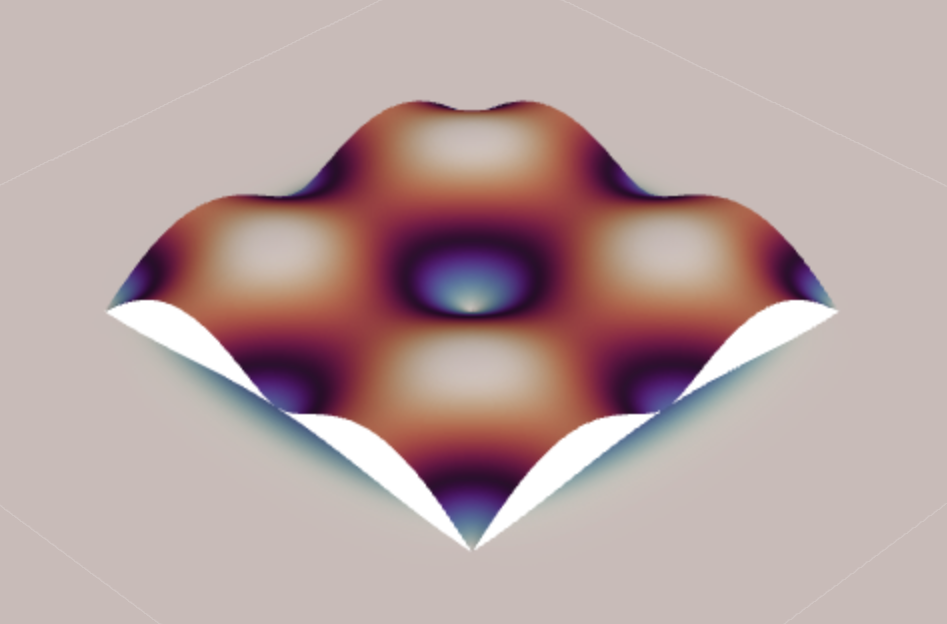

# FEM-QED

FEM-based three-dimensional electrodynamic modeling approach to superconducting circuits and materials.

## Cavity with superconducting boundary conditions

See [cavity_with_sc_bounday.py](cavity_with_sc_bounday.py).

  

Within the cavity, 

$$
\nabla\times\nabla\times\mathbf{B} - \mu_{0}\epsilon_{0}\omega^{2} \mathbf{B} = 0
$$

Within the superconductor,

$$
\nabla\times\nabla\times\mathbf{B} - \left( \mu_{0}\epsilon_{0}\omega^{2}-\frac{1}{\lambda_{L}^{2}} \right) \mathbf{B} = 0
$$

where $\lambda_{L}$ is the London penetration depth.

At the outside boundary of the domain, Direchlet boundary conditions are applied,

$$
\mathbf{n}\times\mathbf{B} = 0
$$
